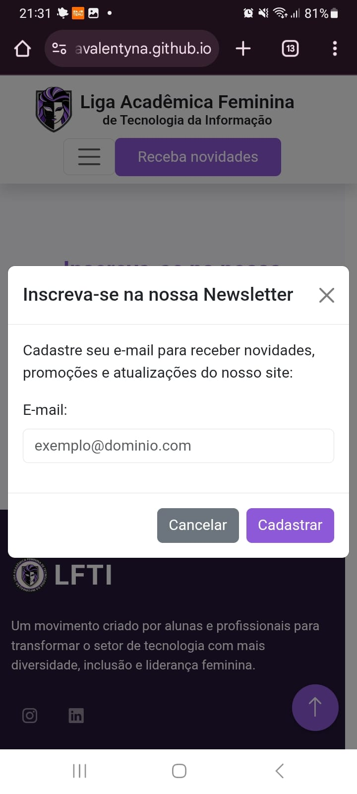

# 💻 Site Oficial da Liga Feminina de TI - UVV

Bem-vindo(a) ao repositório do **site oficial da Liga Feminina de TI da Universidade de Vila Velha (UVV)**!
Este projeto foi desenvolvido com muito carinho durante o **1º Hackathon da Liga Feminina de TI**, com o propósito de criar uma plataforma digital que represente nossa identidade, fortaleça nossa comunidade e valorize a presença feminina na tecnologia.

> **"Este site é mais do que código — é um passo concreto rumo à equidade de gênero na TI."**

---

## ✨ Sobre o Projeto

A **Liga Feminina de TI** é composta por estudantes e profissionais que acreditam no poder da prática: mentorias, treinamentos, projetos e pesquisas. A proposta do site é refletir essa missão, proporcionando:

* Acesso às informações da Liga;
* Visibilidade para integrantes e iniciativas;
* Cadastro de e-mails para manter o contato com interessadas;
* Um design acessível e responsivo.

Atualmente, mulheres representam menos de 20% do setor de TI. Esta plataforma é um esforço para mudar esse cenário.

---

## 📦 Como Rodar o Projeto Localmente

### 1. Clone o Repositório

```bash
git clone https://github.com/SousaValentyna/hackathon-liga-feminina-ti-uvv.git
cd hackathon-liga-feminina-ti-uvv
```

### 2. Instale as Dependências

Este projeto utiliza apenas **HTML, CSS e JavaScript puro**, portanto **não é necessário instalar pacotes** com npm ou yarn.

> ⚠️ Para o envio de e-mails funcionar corretamente, será necessário configurar o **Firebase** e o **EmailJS**.

---

## 🔥 Configurações Necessárias

### Firebase

1. Acesse o [Firebase Console](https://console.firebase.google.com/).
2. Crie um novo projeto.
3. Vá em **Firestore Database** e crie um banco.
4. Registre um app Web e copie as configurações.
5. Substitua os valores no arquivo `email.js`:

```js
const firebaseConfig = {
  apiKey: "SUA_API_KEY",
  authDomain: "SEU_DOMINIO.firebaseapp.com",
  projectId: "SEU_PROJECT_ID",
  storageBucket: "SEU_BUCKET.appspot.com",
  messagingSenderId: "SEU_SENDER_ID",
  appId: "SEU_APP_ID"
};
```

### EmailJS

1. Crie uma conta em [EmailJS](https://www.emailjs.com/).
2. Configure um serviço (ex: Gmail).
3. Use o modelo `template.txt` disponível na pasta `data`.
4. Adicione os dados no `email.js`:

```js
emailjs.init("SUA_PUBLIC_KEY");

function sendEmail() {
  emailjs.send("SEU_SERVICE_ID", "SEU_TEMPLATE_ID", {
    name: nome,
    email: email,
    message: mensagem
  }).then(response => {
    console.log("E-mail enviado com sucesso!", response.status, response.text);
  }).catch(error => {
    console.log("Erro ao enviar e-mail:", error);
  });
}
```

---

## ▶️ Executando o Projeto

* Basta abrir o arquivo `index.html` diretamente no navegador;
* Ou, para uma melhor experiência, use a extensão **Live Server** no VS Code.

---

## 🖼️ Prévia do Projeto

### Página Inicial


### Sobre a Liga


### Processo Seletivo


### Painel de Membros


### Galeria


### Cadastro de E-mails


---

## 🎥 Vídeo Demonstrativo

<div align="center">

[](https://youtu.be/VNYOBA_8oUQ)

<br/>

🎬 **Clique na imagem para assistir ao vídeo!**

</div>

---

## ✅ Funcionalidades

### Requisitos Atendidos:

* 🟢 Informações institucionais (Missão, Visão, História);
* 🟢 Painel de membros;
* 🟢 Cadastro de e-mails com validação;
* 🟢 Página dedicada ao processo seletivo;
* 🟢 Galeria de imagens e vídeos.

### Funcionalidades Extras:

* 💬 Painel de postagens para atualizações;
* 💾 Armazenamento seguro de e-mails no Firebase Firestore.
* 📧 Integração com EmailJS para envio de mensagens;
* 📝 Conteúdo dinâmico com arquivos JSON + JavaScript.
* 📱 Design totalmente responsivo;
* 🎨 Protótipo no Figma.

---

## 📷 Extras Visuais

#### Painel de Posts


#### Firestore


#### Template EmailJS


#### Conteúdo Dinâmico


#### Responsividade (Mobile)

<p>
  
  
  
  
</p>

#### Protótipo Figma

🔗 [Ver no Figma](https://www.figma.com/design/AJQLE5CbRNTKe5caOjU7LA/prototipo-liga-feminina-ti-uvv?node-id=0-1&p=f&t=wQ3UcY8n6wcxVbFi-0)

---

## 🛠️ Tecnologias Utilizadas

* **HTML5, CSS3 e JavaScript**
* **Bootstrap** – layout e componentes responsivos
* **Firebase Firestore** – banco de dados em nuvem
* **EmailJS** – envio de e-mails no frontend
* **Figma** – design e prototipação

---

## 🚀 Minha Jornada no Hackathon

Participar do Hackathon foi uma experiência transformadora!

### O que fiz:

* Desenvolvi o design no Figma;
* Codifiquei o site com HTML, CSS e JS;
* Integrei Firebase e EmailJS;
* Garanti a responsividade;
* Cumpri todos os requisitos do edital.

### Principais Desafios:

* Aprender a configurar o Firebase;
* Compreender o EmailJS e seus templates;
* Ajustar o design para diferentes dispositivos;
* Gerenciar o tempo com foco e organização.

---

## 💬 Conclusão

> "Este projeto é uma declaração de que mulheres na tecnologia têm talento, criatividade e voz. Espero que você sinta essa energia ao navegar pelo site. 💜"

---

## 🔗 Contato

<table align="center">
  <tr>
    <td align="center">
      <a href="https://www.linkedin.com/in/valentynasousa/" title="Perfil de Valentyna de Sousa">
        <br>
        <sub><b>Valentyna de Sousa</b></sub>
      </a>
    </td>
  </tr>
</table>
