````markdown
# 💻 Site Oficial da Liga Feminina de TI - UVV

Oi! Eu sou a pessoa por trás deste projeto, criado com muito carinho durante o **1º Hackathon da Liga Feminina de TI da Universidade de Vila Velha**. A ideia nasceu da vontade de construir o site oficial da nossa Liga — um espaço que seja **funcional, acessível e responsivo**, e que represente toda a força da nossa identidade e valores.

Mais do que uma simples página, este projeto representa um compromisso real: o de fortalecer e dar voz às mulheres na tecnologia. Afinal, ainda somos menos de 20% nas vagas da área — e essa plataforma é um passo para mudar essa realidade, incentivando o protagonismo, o apoio mútuo e a aplicação prática do que aprendemos.

A **Liga Feminina de TI** é formada por mulheres incríveis, estudantes e profissionais, que acreditam no poder da capacitação prática — mentorias, treinamentos, projetos e pesquisas — para criar **lideranças femininas** e trazer mais diversidade para o setor tech.

---

## 📦 Como Rodar o Projeto Localmente

Quer testar o site aí no seu computador? É super simples, só seguir os passos abaixo:

### 1. 🔁 Clone o Repositório

```bash
git clone https://github.com/SousaValentyna/hackathon-liga-feminina-ti-uvv.git
cd hackathon-liga-feminina-ti-uvv
````

### 2. 📁 Instale as Dependências

Este projeto usa apenas HTML, CSS e JavaScript puro. Então, não é necessário instalar pacotes via npm ou yarn.

> ⚠️ Para o cadastro de e-mails funcionar, será necessário configurar o **Firebase** e o **EmailJS** (te explico abaixo).

### 3. 🔥 Configuração do Firebase

1. Acesse o [Firebase Console](https://console.firebase.google.com/).
2. Crie um novo projeto (ou utilize um existente).
3. Vá em **Firestore Database** e crie um banco de dados.
4. Nas configurações do projeto, registre o app como "Web App" e copie as configurações (apiKey, authDomain, etc).
5. No seu projeto, cole essas informações no arquivo de configuração (por exemplo, em `email.js`):

```js
const firebaseConfig = {
  apiKey: "SUA_API_KEY",
  authDomain: "SEU_DOMÍNIO.firebaseapp.com",
  projectId: "SEU_PROJECT_ID",
  storageBucket: "SEU_BUCKET.appspot.com",
  messagingSenderId: "SEU_SENDER_ID",
  appId: "SEU_APP_ID"
};
```

### 4. 📧 Configuração do EmailJS

1. Crie uma conta gratuita em [EmailJS](https://www.emailjs.com/).
2. Configure um serviço de e-mail (como Gmail).
3. Use o template pronto disponível no arquivo `template.txt` (pasta `data`).
4. Copie o **Service ID**, **Template ID** e **Public Key**.
5. No `email.js`, inicialize o serviço assim:

```js
emailjs.init("SUA_PUBLIC_KEY");

function sendEmail() {
  emailjs.send("SEU_SERVICE_ID", "SEU_TEMPLATE_ID", {
    name: nome,
    email: email,
    message: mensagem
  }).then(response => {
    console.log("E-mail enviado com sucesso!", response.status, response.text);
  }).catch(error => {
    console.log("Erro ao enviar e-mail:", error);
  });
}
```

### 5. ▶️ Executando o Projeto

* Você pode abrir o `index.html` diretamente no navegador (duplo clique);
* Ou usar a extensão **Live Server** no VS Code para uma experiência mais fluida.

---

## 🖼️ Dê uma olhada no site!

### Página Inicial

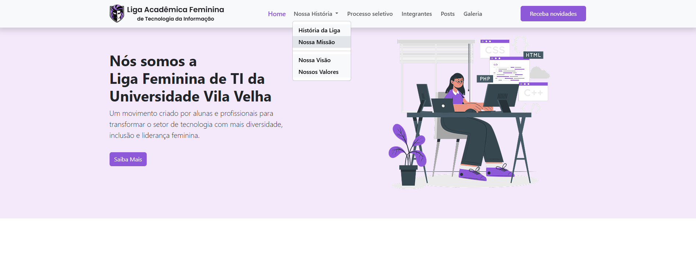
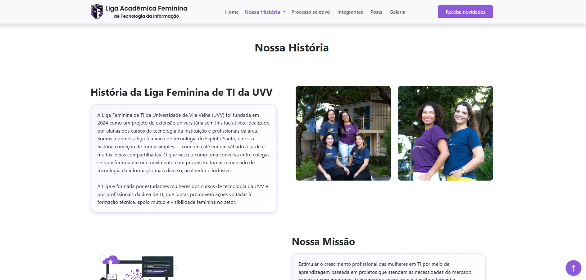
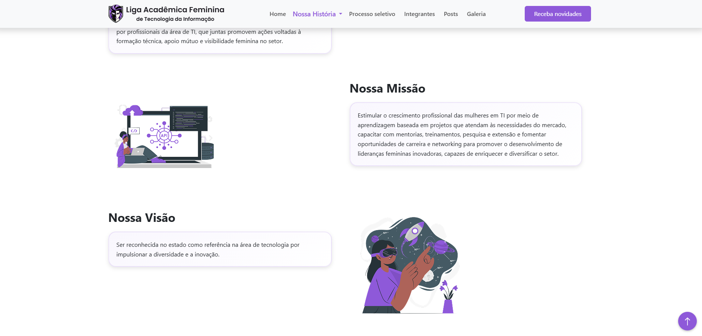
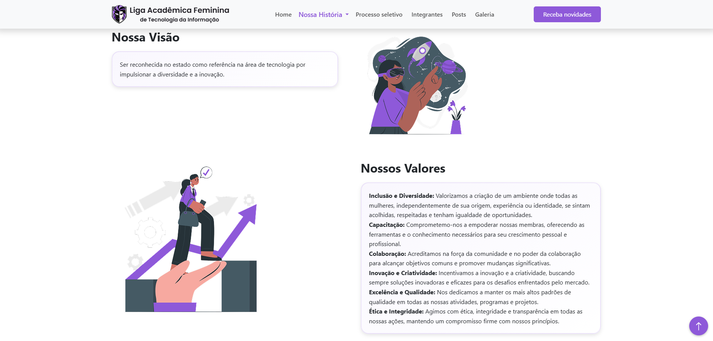

### Painel de Membros

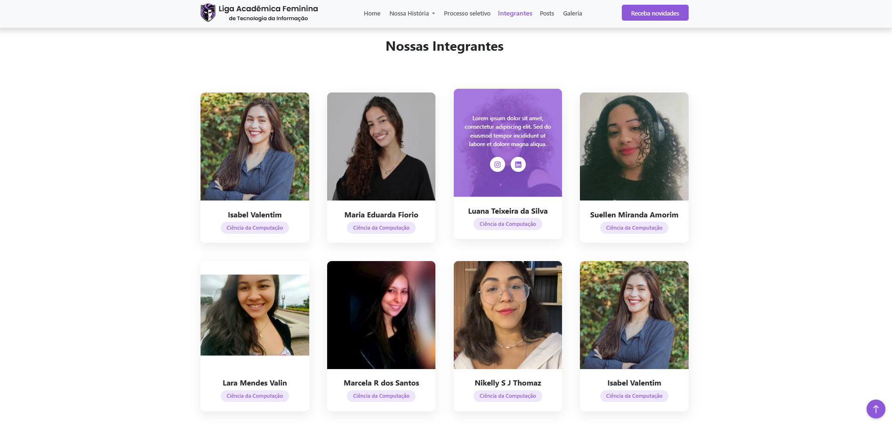

### Cadastro de E-mail

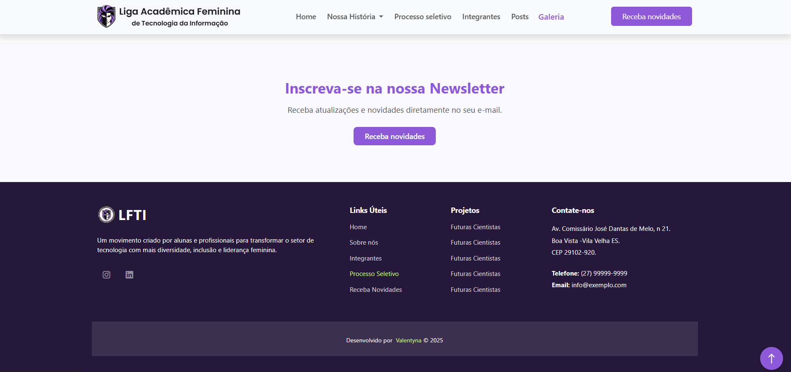

### Processo Seletivo

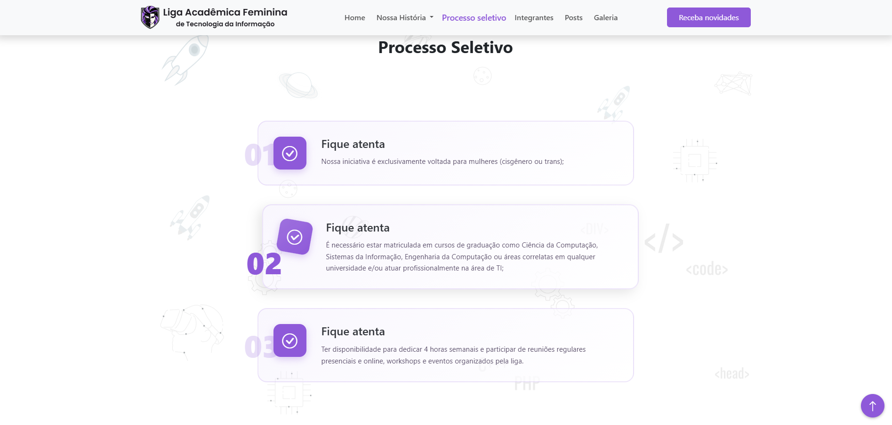

### Galeria de Fotos e Vídeos

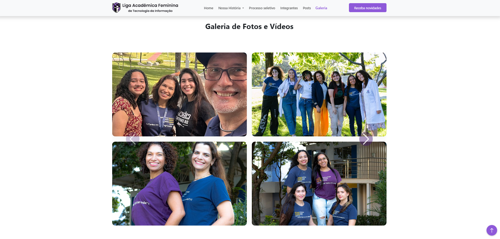

---

## 🎥 Vídeo Demonstrativo

> (Adicione aqui o link do vídeo demonstrativo no YouTube ou outra plataforma, como o Loom.)

[🔗 Assistir ao vídeo](#)

---

## ✅ Funcionalidades

### Requisitos Atendidos:

* 🟢 **R1 – Informações gerais da Liga:** Missão, visão, objetivos e história com identidade visual.
* 🟢 **R2 – Painel de membros:** Lista dinâmica, alimentada via JSON.
* 🟢 **R3 – Cadastro de e-mails:** Validação, confirmação visual e armazenamento seguro via Firebase.
* 🟢 **R4 – Página do processo seletivo:** Guia completo para novos participantes.
* 🟢 **R5 – Galeria de fotos e vídeos:** Layout flexível e responsivo.

### Funcionalidades Extras:

* 💬 Painel de postagens para notícias recentes.
* 💾 Armazenamento seguro de e-mails no Firebase Firestore.
* 📧 Envio automático de e-mails com EmailJS.
* 📝 Conteúdo dinâmico com arquivos JSON + JavaScript.
* 📱 Design responsivo para todas as telas.
* 🎨 Protótipo visual desenvolvido no Figma.

#### Painel de Posts

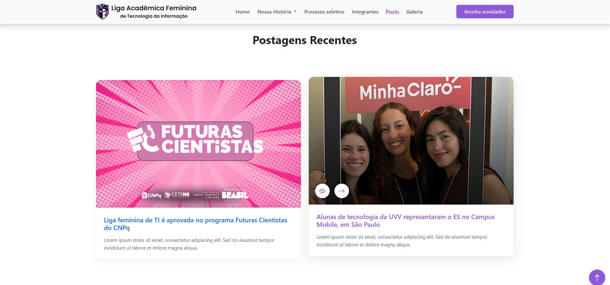

#### Firebase Firestore

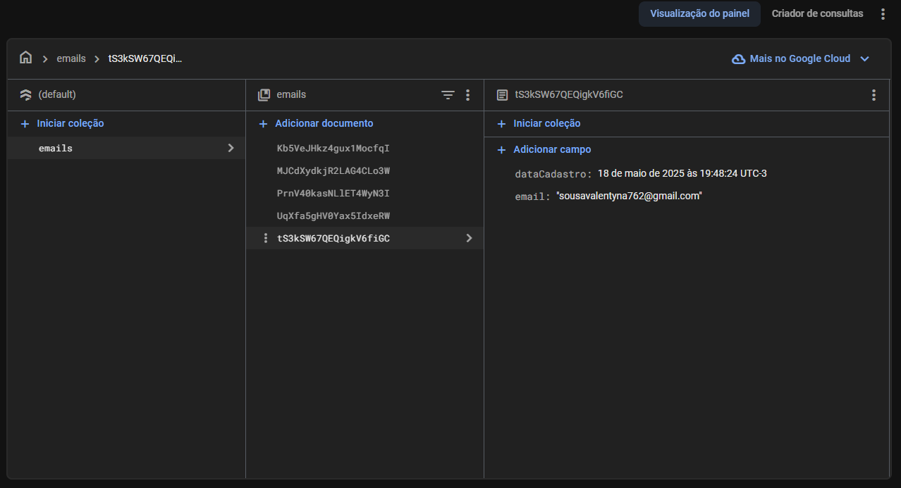

#### EmailJS

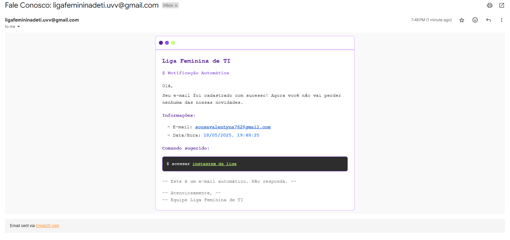

#### Conteúdo Dinâmico

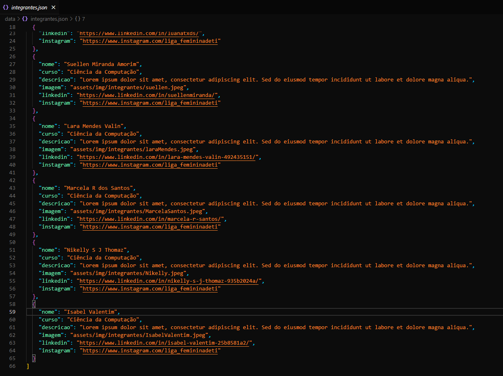

📱 Design Responsivo
Veja como o site se adapta perfeitamente a qualquer dispositivo, incluindo celulares:

<h4>💡 Versão Mobile</h4> <p> 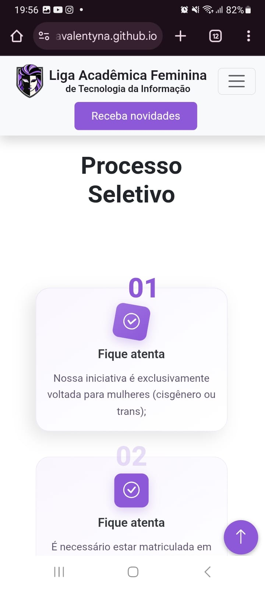 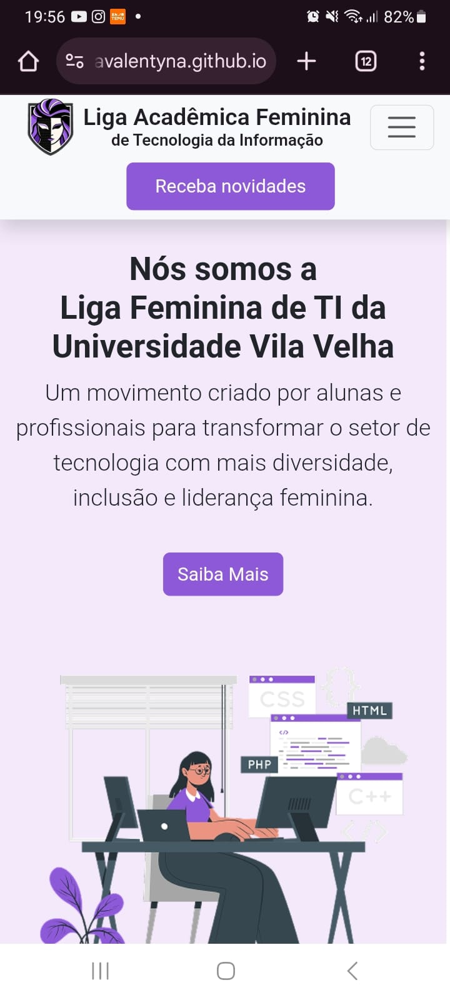 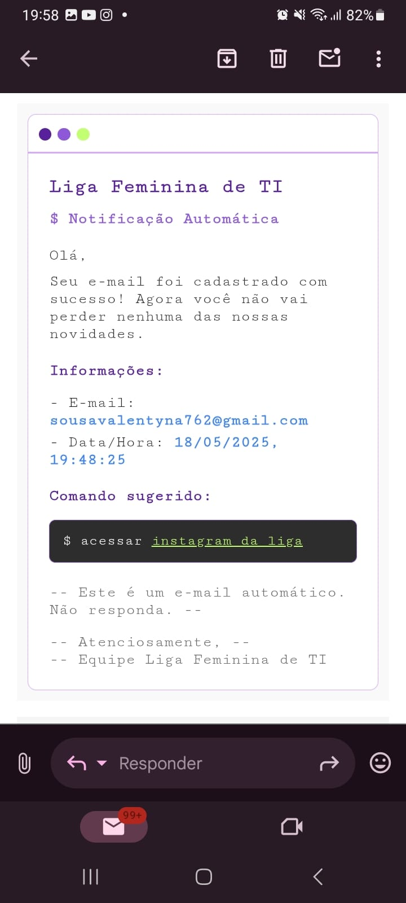 </p>

#### Protótipo Figma

🔗 [Visualizar Protótipo no Figma](https://www.figma.com/design/AJQLE5CbRNTKe5caOjU7LA/prototipo-liga-feminina-ti-uvv?node-id=0-1&p=f&t=wQ3UcY8n6wcxVbFi-0)

---

## 🛠️ Tecnologias Utilizadas

* **HTML5, CSS3 e JavaScript**: Desenvolvimento do site com foco em acessibilidade e responsividade.
* **Bootstrap**: Para componentes e layout responsivo.
* **Firebase Firestore**: Banco de dados em nuvem para armazenar e-mails.
* **EmailJS**: Envio de e-mails diretamente do frontend.
* **Figma**: Protótipos e identidade visual.

---

## ✨ Minha Jornada no Hackathon

Participar do Hackathon da Liga Feminina de TI foi mais que um desafio técnico — foi uma transformação pessoal!

### O que eu fiz:

* Estudei o edital com atenção para garantir todos os requisitos.
* Criei o design no Figma, com foco em representatividade.
* Codifiquei com HTML, CSS e JS puro, com dados dinâmicos.
* Implementei Firebase e EmailJS para uma solução mais completa.
* Testei o site em diferentes dispositivos e tamanhos de tela.

### Desafios Enfrentados:

* Configuração inicial do Firebase exigiu pesquisa e paciência.
* Integração com EmailJS foi uma descoberta sobre templates e variáveis dinâmicas.
* Tornar o design responsivo exigiu muitos testes e ajustes.
* Trabalhar com prazos curtos desenvolveu meu foco e organização.

---

## 💬 Conclusão

> **Este projeto não é só código — é uma declaração de que mulheres na tecnologia têm talento, criatividade e muito a contribuir. Espero que você sinta essa energia ao visitar o site. 💜**

---

## 🔗 Me encontre no LinkedIn

[](https://www.linkedin.com/in/valentyna-sousa/)

```
